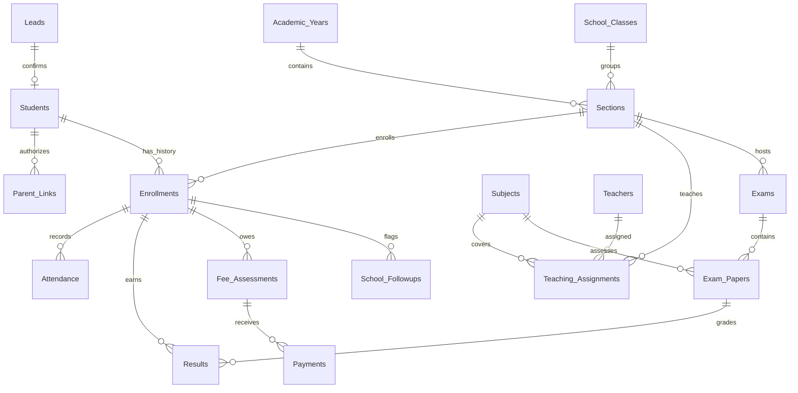

# Structure and design decisions

CRM is the system of record. Creator is a private, read-only parent view. The Go adapter reads/writes CRM in live mode; local JSON storage is only a runnable assignment demonstration. The shared schema is `packages/schema/schema.json`.

| Module                                     | Purpose / invariant                                                                                                                                   |
| ------------------------------------------ | ----------------------------------------------------------------------------------------------------------------------------------------------------- |
| Leads                                      | Child is `Last_Name`; parent name/email are separate. Status pipeline, desired section, follow-up date. Email is not unique, so siblings can enquire. |
| Students                                   | Stable person record with unique `Student_ID`. `Admission_Key` ties a confirmed enquiry to exactly one student.                                       |
| Academic_Years / School_Classes / Sections | Section belongs to a class and a year. A new year gets new section records.                                                                           |
| Teachers / Subjects / Teaching_Assignments | Teacher and subject assignment for a particular section; one assignment per section/subject.                                                          |
| Enrollments                                | Student + academic year is unique. Previous enrollments remain unchanged when promoted.                                                               |
| Parent_Links                               | Student + normalized parent email is unique; explicit `Active`/`Revoked` access supports siblings and multiple guardians.                             |
| Attendance                                 | Enrollment + ISO date is unique; must be within enrollment/year dates and not in the future.                                                          |
| Exams / Exam_Papers                        | Exam belongs to section; paper belongs to exam + subject and defines maximum/pass marks.                                                              |
| Results                                    | Enrollment + paper is unique; exam section must match; marks in range.                                                                                |
| Fee_Assessments / Payments                 | Fee belongs to enrollment; each installment has its own immutable record and unique receipt reference.                                                |
| School_Followups                           | Derived native CRM queue. Stable keys reopen/resolve an existing concern rather than creating duplicates.                                             |

## Admission and year history

Confirmation creates a student, parent link, enrollment, then marks the Lead confirmed. Zoho does not provide a transaction across these modules. The process is therefore **resumable**, keyed by unique CRM fields. After an interruption, press Confirm again. It finds completed stages and continues. The app does not automatically retry ambiguous write failures.

This intentionally keeps admissions in Leads and creates a custom student record, rather than creating unrelated sales Accounts/Deals through CRM's standard sales conversion. School staff can still follow the entire admission journey from the Lead and its Student lookup.

Promotion creates an enrollment in a later, non-overlapping year, then completes the previous enrollment. Attendance, results and fee assessments continue to reference the original enrollment. This preserves historical class and section context. A partial failure can temporarily leave both enrollments active; retry the same promotion to finish it. Do not manually overwrite the old enrollment's section/year.

## Calculations

- Attendance: `(Present + Late) / (Present + Late + Absent) × 100`. Excused is excluded. No counted records displays as no data, rather than 100%.
- Results: percentage by each paper's maximum; summary performance is `sum(marks) / sum(maximum marks)`. Grade thresholds: A+ 90, A 80, B 70, C 60, D 40, F below 40; falling below the paper's pass marks also means F.
- Fees: collected = sum of installments; outstanding = max(total − collected, 0); credit = max(collected − total, 0). Overpayments remain visible as credit on that assessment and do not erase another assessment's debt. No transfer/refund workflow is claimed.
- Money in the web reports is added in integer paise to avoid floating-point artifacts. Input permits two decimal places. Native Deluge uses decimal values and rounding.
- Native CRM rollups are materialized convenience fields for reports; the payment ledger remains authoritative. Event workflows plus daily reconciliation repair stale totals after concurrent writes or failed workflows. The Creator page computes directly from the ledger.

## Parent authorization and CRM–Creator integration

1. Admin verifies the parent and creates an active `Parent_Links` record, then invites that exact email to the private Creator portal.
2. Creator reads `zoho.loginuserid` from its authenticated session. The browser cannot supply or override identity.
3. Server-side Deluge searches matching parent links and checks exact normalized email again. This protects against CRM text-search normalization.
4. The requested child ID must be among those links. The selected enrollment must belong to that child. Guessing another child/enrollment ID fails closed.
5. Only that enrollment's attendance, results, assessments and payments are read. No CRM credentials, other parents, internal notes, or other children are rendered.
6. Every page load rereads CRM. A revoked link takes effect on the next request without waiting for a synchronization job.

Creator stores no mirror of student or financial records. That removes webhook delivery/retry ordering and stale-copy problems for this read-only portal. Pagination is explicit; requests that exceed the supported search window return an error instead of incomplete totals. See Zoho's [logged-in user variable](https://www.zoho.com/deluge/help/zoho-variables.html) and [Creator page snippets](https://help.zoho.com/portal/en/kb/creator/developer-guide/pages/page-script-and-variables/articles/page-scripts-and-variable).

## Additional feature: early-support queue

Low attendance and unpaid fees can go unnoticed in separate modules. A queue puts actionable concerns beside the student's record. Attendance flags use the latest 30 recorded days, at least five counted days, and a threshold below 75%. Fee flags require a positive outstanding balance and a past due date. The local dashboard computes the queue on refresh. `review_support.deluge` maintains equivalent native CRM `School_Followups` records, reusing stable keys and automatically resolving concerns after recovery or payment. No external notification is sent.

The companion threshold is configurable with `ATTENDANCE_ALERT_THRESHOLD`; if changed from 75, update the literal in the native review function too. This is documented instead of assuming native Deluge can read the local `.env`.

## Limits and scaling

- The companion is a single-admin, single-school app. Sessions and write serialization are in-process. Use one API instance for this assignment; native CRM roles provide teacher/admissions/finance permissions. A distributed deployment needs shared session storage and coordinated mutations.
- The companion loads whole module datasets for an interactive small-school dashboard. This is not a large-district analytics implementation. Use native CRM reports/Bulk APIs or paginated query endpoints for larger deployments.
- Native search functions fetch 200 rows/page with a bounded window. A per-enrollment attendance history normally fits a school year; a limit hit fails explicitly. The daily schedule must be split into batches with persisted cursors before organization size exceeds execution/API budgets.
- Keys must be populated **before save**, enforced by CRM unique constraints, and protected with profile/layout permissions. After-save workflows alone do not prevent duplicate records.
- Native scripts and provisioning requests are supplied as source. Tenant-specific compilation, API-name checks, associations, permission verification, and live acceptance testing are still required.
